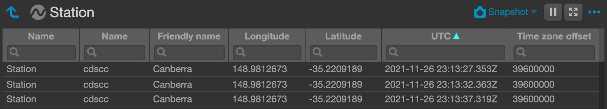
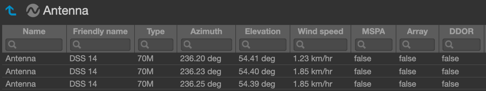
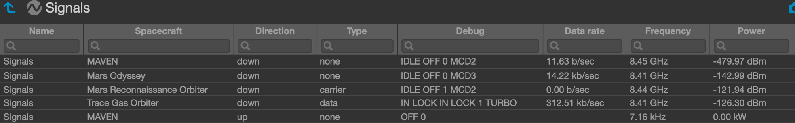
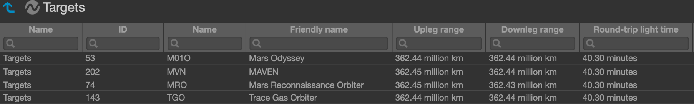
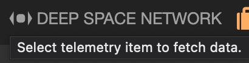
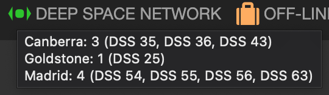
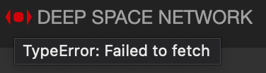
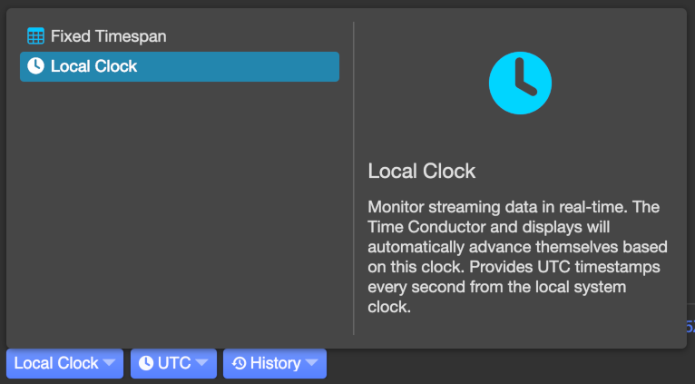

# openmct-dsn

openmct-dsn is a plugin for NASA's [Open Mission Control Technologies (Open MCT)](https://github.com/nasa/openmct) data visualisation framework. It integrates telemetry from the Deep Space Network by adding domain objects representing stations, antennas, signals and spacecraft. When one of these domain objects is selected, data will be made available every five seconds, using the same data source as the [Deep Space Network Now](https://eyes.nasa.gov/dsn/) website.

## Stations

Telemetry that's available for stations includes:
- Name
- Friendly name
- Longitude
- Latitude



## Antennas

Telemetry that's available for antennas includes:
- Name
- Friendly name
- Type
- Azimuth
- Elevation
- Wind speed
- MSPA
- Array
- DDOR



## Signals

Telemetry that's available for signals includes:
- Spacecraft
- Direction
- Type
- Debug
- Data rate
- Frequency
- Power



## Targets

Telemetry that's available for targets includes:
- Spacecraft ID
- Name
- Friendly name
- Upleg range
- Downleg range
- Round-trip light time



## Indicator

openmct-dsn includes an indicator to help identify which antennas are sending or receiving signals. On the initial load of the plugin, the indicator will prompt to select a telemetry item to fetch data.



After selecting any domain object with telemetry, the indicator will update with a summary of which antennas are active and have signal data.



If an error is thrown getting or parsing data from the Deep Space Network then this will be reflected with a different style and a message about the error that occurred.



## Installation

1. Follow the steps to [build and run Open MCT](https://github.com/nasa/openmct#building-and-running-open-mct-locally).

2. Clone openmct-dsn.

    `git clone https://github.com/tobiasbrown/openmct-dsn.git`

3. Copy the `dsn` directory to Open MCT's `plugins` directory.

    `cp -R path/to/openmct-dsn/dsn path/to/openmct/src/plugins/dsn`

4. Update Open MCT's [plugins.js](https://github.com/nasa/openmct/blob/master/src/plugins/plugins.js) to import and add openmct-dsn with the other plugins.

    ```javascript
    define([
        ...,
        './dsn/src/plugin'
    ], function (
        ...,
        DsnPlugin
    ) {
        ...
        plugins.DsnPlugin = DsnPlugin.default;
    }
    ```

5. Update Open MCT's [index.html](https://github.com/nasa/openmct/blob/master/index.html) to install openmct-dsn.

    ```javascript
    openmct.install(openmct.plugins.DsnPlugin());
    ```

6. Start Open MCT.

    `npm start`

7. Ensure that the local clock is selected.

    

📡 〰️〰️〰️〰️〰️ 🛰️
